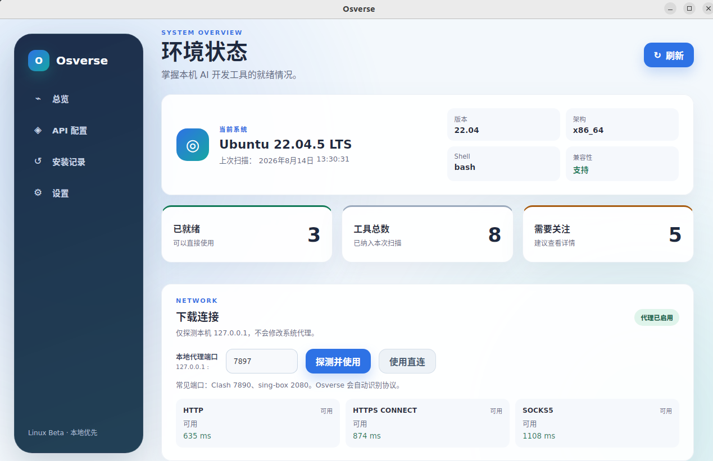
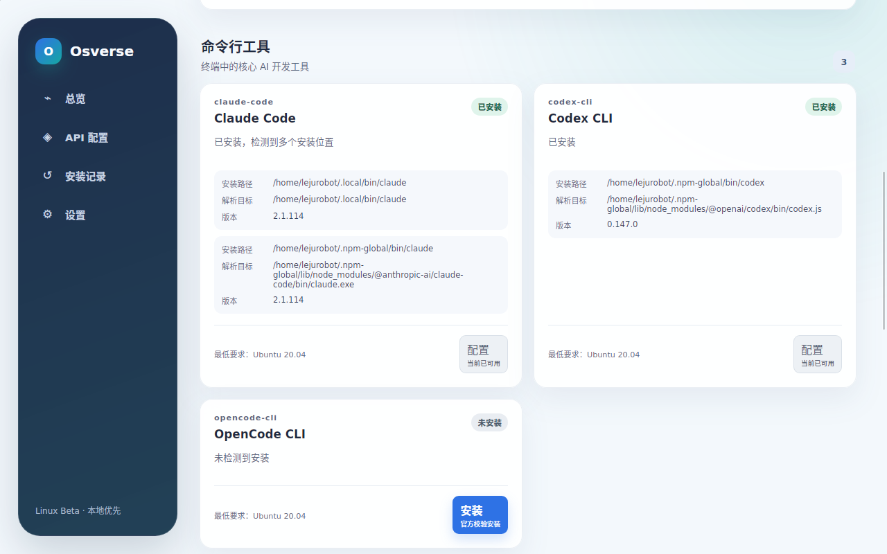
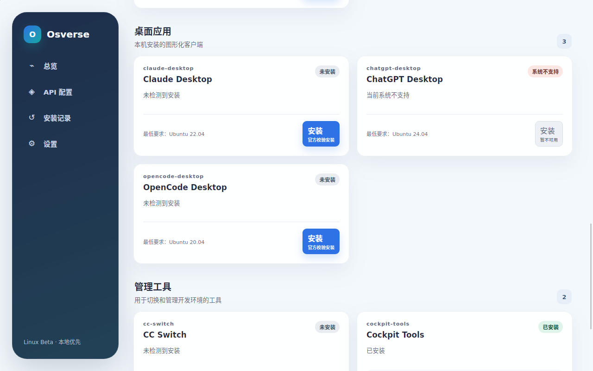
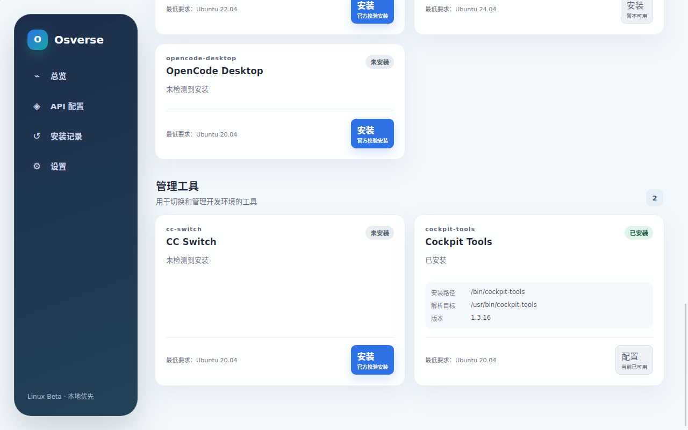
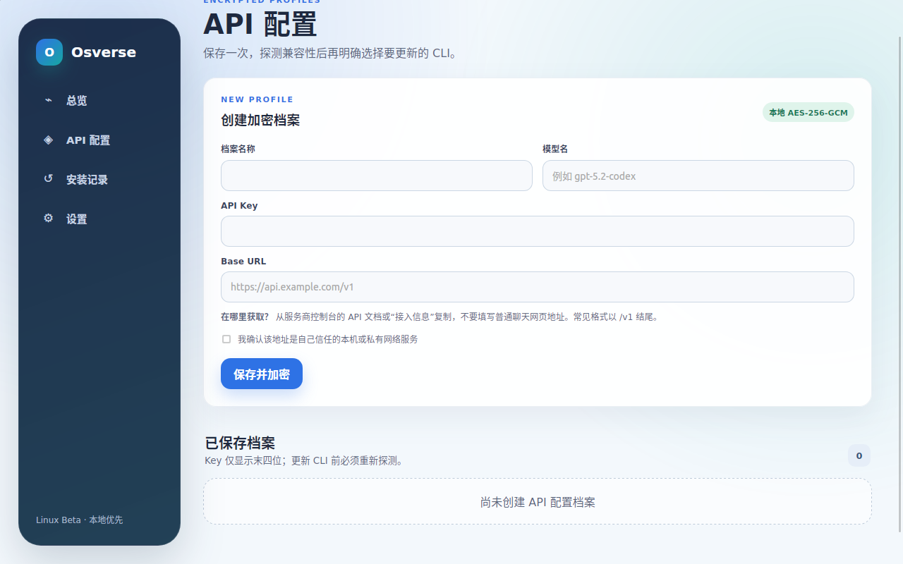

# Osverse

<p align="center">
  
</p>

<p align="center">
  <strong>你的本地 AI 开发环境控制台。</strong><br>
  在一个界面里检测、安装、更新、启动和安全移除 Claude Code、Codex CLI、OpenCode、DeepSeek Harness、Qwen Code、Kimi Code、GitHub Copilot CLI、Gemini CLI、桌面应用与第三方 API。
</p>

<p align="center">
  <a href="README.en.md">English</a> ·
  <a href="https://github.com/Oswald-Hao/Osverse/releases">下载</a> ·
  <a href="docs/testing/linux-v1-acceptance.md">Linux 验收</a> ·
  <a href="docs/testing/windows-v1-acceptance.md">Windows 验收</a> ·
  <a href="CONTRIBUTING.md">参与贡献</a>
</p>

<p align="center">
  <a href="https://github.com/Oswald-Hao/Osverse/actions/workflows/ci.yml"></a>
  <a href="https://github.com/Oswald-Hao/Osverse/releases"></a>
  <a href="LICENSE"></a>
  
  
  
</p>

> [!IMPORTANT]
> Osverse 目前支持 **Ubuntu 20.04/22.04 x86_64** 与 **Windows 10/11 x64**。Windows 版已通过原生 Runner 的测试、安装、启动和卸载验证；macOS 将在 Windows 版稳定后适配。



## 为什么做 Osverse？

换一台电脑，不应该重新花几个小时找运行时、代理端口、CLI 安装位置和各不相同的 API 配置文件。Osverse 把这些工作收进一个可检查、可确认、可恢复的桌面流程，并且尊重你已经安装好的工具。

- **已有工具无需搬家。** Claude Code、Codex CLI、OpenCode、Qwen Code、Kimi Code、GitHub Copilot CLI、Gemini CLI 会从用户真实可用的命令路径中发现，不要求放进 Osverse 目录。
- **DeepSeek Harness 开箱即用。** Osverse 固定官方 Harness 与 Node.js 版本，逐个校验锁定依赖，不执行 npm 生命周期脚本；安装后可直接启动官方 Web 工作台，并能把已验证的第三方 API 档案安全应用到 Harness。
- **Qwen Code 不依赖本机 Node。** Osverse 使用官方跨平台独立包，固定版本、长度和 SHA-256，安全解包后用包内 Node 启动；第三方 OpenAI 兼容 API 也可从 API 档案直接应用。
- **Kimi Code 原生接入第三方 API。** Osverse 校验并安装官方独立二进制，可将已确认的 OpenAI Chat、OpenAI Responses 或 Anthropic Messages 档案写入 Kimi 原生 Provider，同时保持服务商的精确模型名。
- **GitHub Copilot CLI 可验证安装。** Osverse 使用 GitHub 官方 standalone 包，锁定版本、长度和 SHA-256，并关闭上游自更新以避免绕过 Osverse 的统一更新验证；登录与订阅仍由 GitHub Copilot 管理。
- **Gemini CLI 自带隔离运行时。** Osverse 固定 Google 官方 Apache-2.0 bundle 与 Node.js 版本，分别校验精确长度和 SHA-256，不执行 npm 生命周期脚本，也不要求安装或改动系统 Node/npm。
- **每个真实安装都能控制。** 同一工具存在多个安装位置时会分别展示；启动前由后端重新扫描并核对文件身份，不会执行界面传入的任意路径。
- **安装过程可解释。** 安装前显示后端生成的变更计划；下载同时校验固定长度和 SHA-256；版本原子切换，失败和异常退出都可恢复。
- **移除可以预览和恢复。** 用户安装和 Osverse 管理的文件先进入系统回收站；系统软件包只通过固定提权动作移除，配置、凭据和会话默认保留。
- **API Key 留在本地。** 第三方 API 档案使用 AES-256-GCM 加密，支持安全编辑，先探测协议兼容性，再由用户二次确认写入目标 CLI。
- **代理只服务 Osverse。** 只需输入 `127.0.0.1` 上的端口，软件自动识别 HTTP、HTTPS CONNECT、SOCKS5，并按当前用户记住已验证的协议与端口；不保存代理凭据，不改终端或系统全局代理。延迟 `≤500ms` 为绿色、`501–1000ms` 为黄色、`>1000ms` 为红色。
- **桌面生态统一管理。** 支持的桌面客户端与 API 切换工具可以在同一面板安装、更新和启动。
- **Osverse 自身也能原地更新。** 启动时检查官方 Release，先展示版本与更新说明，再按当前安装方式下载、校验并启动更新，不必卸载或重新去 GitHub 找安装包。

## 能管理什么

| 范围 | Ubuntu 20.04/22.04 | Windows 10/11 x64 |
| --- | --- | --- |
| 核心 CLI | Claude Code、Codex CLI、OpenCode CLI、DeepSeek Harness、Qwen Code、Kimi Code、GitHub Copilot CLI、Gemini CLI 的检测与事务式安装/更新 | 同左；Harness、Qwen Code、Kimi Code、Copilot CLI 与 Gemini CLI 使用独立的受校验用户级运行时 |
| 桌面应用 | Claude Desktop（Ubuntu 22.04+）、OpenCode Desktop | Claude Desktop、OpenCode Desktop、ChatGPT Desktop、Codex Desktop（分别识别） |
| API 管理工具 | CC Switch、Cockpit Tools | CC Switch、Cockpit Tools |
| API 档案 | Anthropic/OpenAI 兼容协议、模型名、Base URL、加密 Key | 同左；主密钥由当前 Windows 用户的 DPAPI 保护 |
| 组件控制 | 启动所有已验证安装、按位置处理冲突、预览并安全移除 | 同左；受管 CLI 移入 Osverse 恢复区 |
| 网络 | 直连或本机 HTTP / HTTPS CONNECT / SOCKS5 代理 | 同左 |
| Osverse 更新 | AppImage 原子替换并重启；便携包安全解包后原子替换；`.deb` 交给系统安装器确认 | 校验 NSIS 安装包后启动并自动退出旧版本 |
| 可审计性 | 脱敏操作历史、校验和、SPDX SBOM、构建来源证明 | 同左 |

Claude Desktop 官方 Linux 包的最低要求是 Ubuntu 22.04，所以在 Ubuntu 20.04 上会明确显示为不支持。ChatGPT Desktop 没有官方 Linux 版本，Osverse 不会提供来源不明的替代安装包。

### DeepSeek Harness

在“核心 CLI”中找到 **DeepSeek Harness**，点击“安装”并确认计划即可。Osverse 会安装官方 `@deepseek-ai/dsh`、独立 Node.js 运行时和当前平台的原生依赖；不要求电脑预装 Node/npm，也不会改动已有的全局 Node 环境。安装完成后点击“启动”，等价于运行：

```bash
dsh web
```

Linux 浏览器工作台默认位于 `http://127.0.0.1:3080`；Windows 会自动选择空闲的本机端口，等真实页面可访问后再打开默认浏览器。启动时出现的终端承载 Harness 服务，请在移除或更新 Harness 前先关闭该终端。你既可以在 Harness 自己的 Models 页面添加 Provider，也可以在 Osverse 的“API 配置”中保存档案、完成协议探测，再勾选 **DeepSeek Harness**。Osverse 会选择已确认的 OpenAI Chat Completions、OpenAI Responses 或 Anthropic Messages 协议，备份并事务式更新 `$DSH_HOME/settings.yaml` 与 `$DSH_HOME/.credentials.yaml`，创建独立的 `osverse` Provider，并把精确模型设为新会话默认值。Key 只写入 Harness 的凭据文件；设置文件只保存 `OSVERSE_API_KEY` 引用。无关 Provider、注释和已有凭据会保留，运行中的 Harness 通过其官方 `.lock` 协议与 Osverse 协调写入，移除 Harness 时这些数据仍默认保留。更完整的使用与安全说明见 [DeepSeek Harness 接入指南](docs/guides/deepseek-harness.md)。

Harness 目前仍是官方 Developer Preview。Osverse 将安装契约固定在已测试版本，不会静默追随 npm 的 `latest`；升级会随新的 Osverse 版本经过测试后提供。Linux x64 和 Windows x64 已接入应用，macOS x64/arm64 的同一校验安装器已经就绪，会随 Osverse macOS 版启用。

### Qwen Code

在“核心 CLI”中选择 **Qwen Code**，确认安装计划后，Osverse 会下载官方 `v0.21.13` 独立包。包内已经包含 Node.js 和平台原生模块，因此不需要安装或修改全局 Node/npm。Linux x64、Linux arm64、Windows x64、macOS x64 与 macOS arm64 的官方制品元数据均已固定；当前 Osverse 应用在 Linux x64 与 Windows x64 上启用安装。

API 档案确认 OpenAI Chat Completions 兼容后，可以同时应用到 Qwen Code。Osverse 会备份并原子更新 `~/.qwen/settings.json`，写入独立的 `osverse` provider、精确模型 ID、Base URL 和受限权限的 Key，再通过 Qwen 的 `openai` 协议精确选中该模型与地址；不会覆盖其他 provider。详见 [Qwen Code 接入指南](docs/guides/qwen-code.md)。

### Kimi Code

在“核心 CLI”中选择 **Kimi Code**，Osverse 会下载官方 `0.36.1` 独立二进制，并对每个平台的官方 URL、精确长度和 SHA-256 做固定校验。Linux x64/arm64、Windows x64/arm64 与 macOS x64/arm64 的制品元数据均已锁定；当前 Linux x64 与 Windows x64 应用启用安装。受管入口会设置 `KIMI_CODE_NO_AUTO_UPDATE=1`，防止上游后台升级绕过 Osverse 的版本验证。

API 档案探测到 OpenAI Chat Completions、OpenAI Responses 或 Anthropic Messages 后，可以勾选 Kimi Code。Osverse 会备份并原子更新 `~/.kimi-code/config.toml`，保留无关配置，创建独立 `osverse` Provider 和模型别名，并把服务商的原始模型 ID（例如 `deepseek/deepseek-v4-flash`）原样交给 Kimi；不会拼接 `osverse/`。详见 [Kimi Code 接入指南](docs/guides/kimi-code.md)。

### GitHub Copilot CLI

在“核心 CLI”中选择 **GitHub Copilot CLI**，Osverse 会安装官方 `v1.0.80` standalone 包。Linux x64、Linux arm64、Windows x64、macOS x64 与 macOS arm64 制品均锁定官方 URL、精确长度和 SHA-256；当前 Linux x64 与 Windows x64 应用已启用安装。命令入口固定加入 `--no-auto-update`，因此运行时只能随经过测试的新 Osverse 版本更新，不会自行覆盖受管文件。

首次启动按提示登录，也可以在终端运行 `copilot login`。使用需要有效的 GitHub Copilot 订阅；它不接受 Osverse 的通用第三方 API 档案，API Key、Base URL 和模型字段不会写入 Copilot 配置。详见 [GitHub Copilot CLI 接入指南](docs/guides/github-copilot-cli.md)。

### Gemini CLI

在“核心 CLI”中选择 **Gemini CLI**，Osverse 会安装 Google 官方 `0.57.0` npm bundle 与独立 Node.js `22.23.2` 运行时。两份制品都固定官方 HTTPS 地址、精确长度和 SHA-256；安装过程直接安全展开经过校验的文件，不运行 npm，也不会写入全局 `node_modules`。当前在 Ubuntu x64 与 Windows x64 应用中启用；上游建议 Ubuntu 20.04+ 与 Windows 11 24H2+。

首次启动后按 Google 官方流程登录，或使用 Gemini API Key。Gemini CLI 不接受 Osverse 的通用 OpenAI/Anthropic 第三方 API 档案，因此 Osverse 不会把这些 Key、Base URL 或模型写入 `~/.gemini`。更新或移除受管运行时时，Google 登录、设置与会话数据默认保留。详见 [Gemini CLI 接入指南](docs/guides/gemini-cli.md)。

## 安装

打开 [GitHub Releases](https://github.com/Oswald-Hao/Osverse/releases)，下载与你的平台匹配的文件。

### Windows（推荐安装包）

下载 `osverse-*-windows-amd64-setup.exe`，双击后按提示安装。安装范围仅为当前用户，不需要管理员权限；安装包内置 WebView2 bootstrapper。也可使用 `*-portable.zip` 免安装版或单文件 `.exe`。

PowerShell 校验：

```powershell
(Get-FileHash .\osverse-*-windows-amd64-setup.exe -Algorithm SHA256).Hash
Get-Content .\SHA256SUMS
```

### Ubuntu

#### AppImage（免安装）

```bash
sha256sum --check SHA256SUMS --ignore-missing
chmod +x osverse-*-linux-amd64-ubuntuXX.XX.AppImage
./osverse-*-linux-amd64-ubuntuXX.XX.AppImage
```

#### Debian 安装包

```bash
sha256sum --check SHA256SUMS --ignore-missing
sudo apt install ./osverse_*_amd64_ubuntuXX.XX.deb
osverse
```

Release 还提供便携 `.tar.gz`、统一 `SHA256SUMS`、SPDX 2.3 SBOM、结构化更新清单和 GitHub 构建来源证明。可这样验证单个文件：

```bash
gh attestation verify ./osverse_*.deb --repo Oswald-Hao/Osverse
```

安装一次之后，Osverse 会通过官方 Release feed 在启动时静默检查新版本；发现更新时显示更新说明并等待确认。更新同样使用当前已验证并持久保存的本机代理，避免共享代理出口的 GitHub REST API 限流；前端不能指定下载地址、文件路径或摘要。

## 安全边界

- 扫描不会执行 Shell 启动文件或 `.desktop` 文件。
- 外部已安装 CLI 保留在原位置；同名外部命令不会被 Osverse 覆盖。
- 启动和移除前会重新扫描并验证目标身份；前端不能提交任意可执行路径或系统包名。
- 用户文件使用可回滚操作移入 Freedesktop 回收站；配置、API 凭据和登录会话默认不删除。
- Windows 上受管 CLI 使用锁定文件身份移入 `%LOCALAPPDATA%\Osverse\recovery`，卸载桌面应用只允许固定的 WinGet ID、Microsoft Store ID、MSI ProductCode 或受信任卸载器路径。
- 安装源来自内置白名单，并同时校验文件长度与 SHA-256。Qwen Code、Kimi Code、Copilot CLI 与 Gemini CLI 会拒绝归档路径穿越、链接、特殊文件和异常归档结构；Gemini CLI 还把官方 bundle 与 Node.js 分别固定校验，DeepSeek Harness 则使用嵌入式 npm lockfile 对每个包做 SHA-512 校验。两者都不会执行 npm 生命周期脚本。
- 安装末段的运行时提交、命令入口和 PATH 激活属于同一事务；失败只回滚本次新写入的版本，保留重新校验通过的已有版本，并明确报告无法自动清理的残留。
- Osverse 自更新只接受固定仓库的语义化版本、匹配平台的结构化清单和精确发布路径；稳定版默认不接收预发布版，测试版可升级到更新的测试版或稳定版。
- Osverse 管理的 CLI 版本位于 `~/.local/share/osverse/tools`，使用不可变版本目录、原子符号链接、即时回滚与权限为 `0600` 的崩溃恢复日志。
- API Key 不会出现在档案列表、历史或日志中；Linux 使用权限受限的 AES-256-GCM 密钥，Windows 再以当前用户 DPAPI 保护主密钥；私网和保留地址必须明确确认。
- Claude Desktop 的提权助手只能执行固定动作，不能运行用户输入的命令。
- 软件不包含遥测，也不会修改系统或终端的全局代理。

漏洞报告方式与完整信任边界见 [SECURITY.md](SECURITY.md)。

## 更多真实截图

<details>
<summary><strong>发现外部安装的 CLI——包括两个不同路径的 Claude Code</strong></summary>



</details>

<details>
<summary><strong>桌面应用检测与平台兼容性</strong></summary>



</details>

<details>
<summary><strong>CC Switch 与 Cockpit Tools 管理</strong></summary>



</details>

<details>
<summary><strong>加密的第三方 API 档案</strong></summary>



</details>

以上截图均来自 Ubuntu 22.04 上真实运行的 Osverse 窗口，不是概念稿。Windows 使用同一套前端界面；平台能力由原生后端提供。

## 从源码运行

固定工具链为 Go 1.25.12、Node.js 22.23.2、Wails 2.15.0。

```bash
sudo apt-get update
sudo apt-get install build-essential libgtk-3-dev libwebkit2gtk-4.0-dev pkg-config
npm --prefix frontend ci
npm --prefix frontend test
npm --prefix frontend run typecheck
go test ./...
go test -race ./...
go vet ./...

# Ubuntu 22.04
go run github.com/wailsapp/wails/v2/cmd/wails@v2.15.0 dev -tags webkit2_40

# Ubuntu 20.04
go run github.com/wailsapp/wails/v2/cmd/wails@v2.15.0 dev -tags webkit2_36
```

Windows 10/11 x64（PowerShell，需 Go、Node.js、WebView2 与 Wails 构建环境）：

```powershell
npm --prefix frontend ci
go test ./...
go test -race ./...
go vet ./...
go run github.com/wailsapp/wails/v2/cmd/wails@v2.15.0 dev

# 生成每用户范围的 NSIS 安装包
go run github.com/wailsapp/wails/v2/cmd/wails@v2.15.0 build -platform windows/amd64 -nsis -webview2 embed -installscope user -trimpath
```

## 分支与贡献

每个问题、功能、依赖升级或文档任务都必须从最新 `origin/dev` 创建独立分支；禁止直接在 `dev`、`beta`、`main` 开发或提交，也不能把无关任务混入同一分支。代码只按 `任务分支 → dev → beta → main` 单向晋级：功能 PR 在进入 `dev` 前运行一次完整 CI；`dev → beta` 与 `beta → main` 的晋级 PR 复用已验证结果，只检查晋级路径，不重复编译，也不会由 CI 自动推送或同步分支。`main` 只接收通过门禁的候选版，发版标签必须属于 `main` 历史。详见[保护分支规则](docs/governance/branch-policy.md)。

欢迎贡献。请先阅读 [CONTRIBUTING.md](CONTRIBUTING.md)，提交聚焦的问题或 PR，并保持现有安全边界。

## 许可证

Apache-2.0，见 [LICENSE](LICENSE)。

Osverse 是独立项目。Claude、Codex、OpenAI、OpenCode、DeepSeek、Qwen、Kimi、Moonshot AI、GitHub、Copilot、Google 和 Gemini 等名称属于各自权利人；列出它们仅表示兼容，不代表背书或合作关系。Copilot CLI 的上游许可证副本随受管运行时一同安装。
